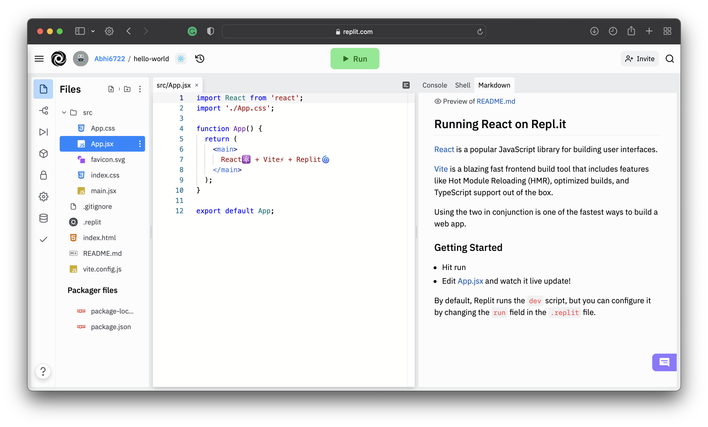

# Hello World

Well if you are going to learn any language then starting from **`Hello World`** is must 😂.
So Let's start with it. 

In order for us to be on same page we are going to use online editor for our maximum task. 
- Head over to [replit](https://replit.com). 
- Create your account 
- Click on **create Repl** 
- In the template section choose `React.Js` 
- Name it `hello-world` and click on create repl button.

You will see a similar image.


- Now Just click on the Run Button.
- You will see that the react application will be up and running.
- Now You just have to edit the content `React⚛️ + Vite⚡ + Replit🌀` to `Hello World!` and you can see Hello world! on the screen.


## In your local editor
To set up `create-react-app`, run the following code in your terminal, one directory up from where you want the project to live.
```
npx create-react-app react-tutorial
```
Once that finishes installing, move to the newly created directory and start the project.
```
cd react-tutorial && npm start
```
Once you run this command, a new window will popup at **[localhost:3000](http://localhost:3000)** with your new React app.

If you look into the project structure, you'll see a /public and /src directory, along with the regular node_modules, .gitignore, README.md, and package.json.

In /public, our important file is index.html, which is very similar to the static index.html file we made earlier - just a root div. This time, no libraries or scripts are being loaded in. The /src directory will contain all our React code.

To see how the environment automatically compiles and updates your React code, find the line that looks like this in /src/App.js:

```
To get started, edit `src/App.js` and save to reload.
```

And replace it with any other text. Once you save the file, you'll notice localhost:3000 compiles and refreshes with the new data.

Go ahead and delete all the files out of the /src directory, and we'll create our own boilerplate file without any bloat. We'll just keep index.css and index.js.

For index.css, I just copy-and-pasted the contents of Primitive CSS into the file. If you want, you can use Bootstrap or whatever CSS framework you want, or nothing at all. I just find it easier to work with.

Now in index.js, we're importing React, ReactDOM, and the CSS file.

```jsx title="src/index.js"
import React from 'react'
import ReactDOM from 'react-dom'
import './index.css'
```

Let's create our App component again. Before, we just had an `<h1>`, but now I'm adding in a div element with a class as well. You'll notice that we use className instead of class. This is our first hint that the code being written here is JavaScript, and not actually HTML.

```jsx title="src/index.js"
class App extends React.Component {
  render() {
    return (
      <div className="App">
        <h1>Hello, React!</h1>
      </div>
    )
  }
}
```
Finally, we'll render the App to the root as before.

```jsx title="src/index.js"
ReactDOM.render(<App />, document.getElementById('root'))
```
Here's our full index.js. This time, we're loading the Component as a property of React, so we no longer need to extend React.Component.

```jsx title="src/index.js"
import React, {Component} from 'react'
import ReactDOM from 'react-dom'
import './index.css'

class App extends Component {
  render() {
    return (
      <div className="App">
        <h1>Hello, React!</h1>
      </div>
    )
  }
}

ReactDOM.render(<App />, document.getElementById('root'))
```
If you go back to [localhost:3000](http://localhost:3000), you'll see "Hello, React!" just like before. We have the beginnings of a React app now.